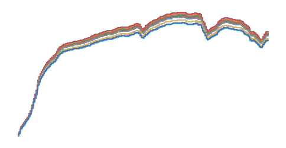

# Hyperspectral time series

Required skills:

* Eradiate: Basic simulation setup, TOA radiance measure configuration
* Xarray: Intermediate dataset manipulation

In this exercise, we simulate a hyperspectral time series inspired by the [PRISMA](https://en.wikipedia.org/wiki/PRISMA_(spacecraft)) instrument over a bright desert target.

1. Open and visualize the surface reflectance, climatology and time series files.
2. Build your simulation sequence. Set up a basic scene with:

   * A smooth RPV surface with its parameters sourced from the sample RPV dataset
   * No atmosphere
   * A directional illuminant positioned based on the sample time series data
   * A distant sensor positioned based on the sample time series data, with a uniform SRF that covers the spectral range of the sensor

3. Run your basic simulation sequence and build a dataset with the results.
4. Post-process the results to perform band integration for each band of the instrument (see the [`apply_spectral_response()`](https://eradiate.readthedocs.io/en/stable/rst/reference_api/pipelines.html#eradiate.pipelines.logic.apply_spectral_response) function). Compute the TOA BRF for each band.
5. Visualize the full-spectrum reflectance for all timesteps of the time series. What explains the variability of the TOA BRF?
6. Complexify your simulation:

   * Add an atmosphere, factoring in the sample climatology
   * Account for planetary curvature
   * Increase the sample count (you might also want to report the variance of the Monte Carlo estimator)
