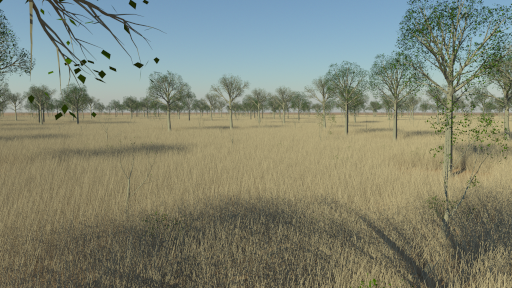

# Savannah pre-fire scene

The objective of this exercise is produce an image similar to the following one:

Required skills:

 * Manipulation of the PerspectiveCamera in Eradiate
 * RAMI-V scene loading
 * Basic familiarity with Eradiate's atmospheric components
 * Basic image visualization using matplotlib

This 3D scene the Savannah pre-fire scene provided by [1] and is included in the [RAMI-V](https://rami-benchmark.jrc.ec.europa.eu/_www/phase_descr.php?strPhase=RAMI5) benchmark.

1. Using the rami scene loader, create a dictionary containing the 3D canopy specification and surface properties. Copy-paste the code snippet `./create_spectral_data_dictionary.py` into your script to generate a `spectral_data` parameter for the [`load_rami_scenario`](https://eradiate.readthedocs.io/en/stable/rst/reference_api/generated/autosummary/eradiate.scenes.biosphere.load_rami_scenario.html#eradiate.scenes.biosphere.load_rami_scenario) function.

2. Define a perspective camera located close to the ground, pointing towards the direction of your choice and observing the RGB components.

3. Define a [`HeterogeneousAtmosphere`](https://eradiate.readthedocs.io/en/stable/rst/reference_api/generated/autosummary/eradiate.scenes.atmosphere.HeterogeneousAtmosphere.html#eradiate.scenes.atmosphere.HeterogeneousAtmosphere) featuring a molecular component and an aerosol component. Use a default [`MolecularAtmosphere`](https://eradiate.readthedocs.io/en/stable/rst/reference_api/generated/autosummary/eradiate.scenes.atmosphere.MolecularAtmosphere.html#eradiate.scenes.atmosphere.MolecularAtmosphere) object, and a default [`ParticleLayer`](https://eradiate.readthedocs.io/en/stable/rst/reference_api/generated/autosummary/eradiate.scenes.atmosphere.ParticleLayer.html#eradiate.scenes.atmosphere.ParticleLayer) object for this visual example.

4. Build your experiment using a [`CanopyAtmosphereExperiment`](https://eradiate.readthedocs.io/en/stable/rst/reference_api/generated/autosummary/eradiate.experiments.CanopyAtmosphereExperiment.html#eradiate.experiments.CanopyAtmosphereExperiment). Add an illumination to the experiment. Run your computations and extract an RGB image using the [`eradiate.xarray.interp.dataarray_to_rgb`](https://eradiate.readthedocs.io/en/stable/rst/reference_api/generated/autosummary/eradiate.xarray.interp.dataarray_to_rgb.html#eradiate.xarray.interp.dataarray_to_rgb) function. Display the resulting image.

## References

[1] M.I. Disney, P. Lewis, J. Gomez-Dans, D. Roy, M.J. Wooster, D. Lajas, 3D radiative transfer modelling of fire impacts on a two-layer savanna system, Remote Sensing of Environment, Volume 115, Issue 8, 2011, Pages 1866-1881, ISSN 0034-4257, https://doi.org/10.1016/j.rse.2011.03.010. (https://www.sciencedirect.com/science/article/pii/S0034425711000873)