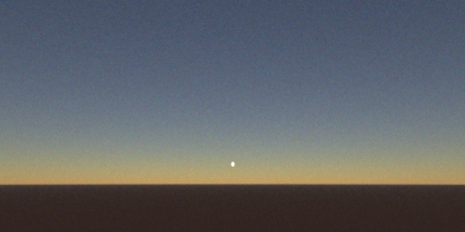

# Polarized sunset

Required skills:

* Eradiate: Basic simulation setup, camera visualization
* Xarray: Basic dataset manipulation and visualization
* Matplotlib: Basic RGB image display

This exercise consists in building a scene that simulates polarized radiative transfer in a sunset setup. All simulations can be done in monochromatic mode.

1. Basic setup
   1. Define a scene consisting of:

      * A smooth surface with a BRDF of your choice (it is recommended to start with Lambertian)
      * An atmosphere with a molecular component
      * A directional illuminant at grazing incidence
      * A perspective camera facing the Sun

   2. Configure the sensor to simulate 3 channels simulating the R, G and B channels of a camera (typically, 660, 550 and 440 nm)
   3. Run the simulation and display an image using the [`dataarray_to_rgb()`](https://eradiate.readthedocs.io/en/stable/rst/reference_api/generated/autosummary/eradiate.xarray.interp.dataarray_to_rgb.html) function.

2. Run the simulation again in polarized mode. Visualize the Stokes vector components and the degree of linear polarization.
3. For now, you cannot see the illuminant. Why? Is there [another illuminant](https://eradiate.readthedocs.io/en/stable/rst/reference_api/scenes.html#module-eradiate-scenes-illumination) that would look more realistic?
4. How do you expect the scene to change if you account for planetary curvature? The ["Problem geometry control"](https://eradiate.readthedocs.io/en/stable/tutorials/getting_started/problem_geometry.html) tutorial explains how to change the scene geometry to spherical-shell.
