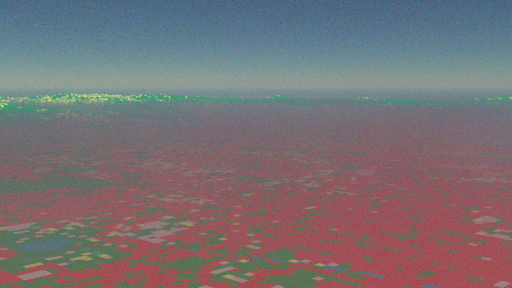

# Digital elevation model texturing

Required skills:

* Eradiate: Basic simulation setup, Expert interface, camera visualization
* Mitsuba: Scene language, texture data generation

This exercise consists in creating a scene that contains a DEM model created after the area nearby Beijing, and texturing it with data that shows the colour code corresponding the ESA World Cover type category.

The DEM is already pre-processed as a PLY mesh with correct texture coordinates. The land cover data and colour coding are provided.

1. Basic setup
   1. Define a scene consisting of:

      * A smooth surface with a Lambertian BRDF
      * No atmosphere
      * A directional illuminant
      * A perspective camera

   2. Configure the sensor to simulate 3 channels simulating the R, G and B channels of a camera (typically, 660, 550 and 440 nm)
   3. Run the simulation and display an image using the [`dataarray_to_rgb()`](https://eradiate.readthedocs.io/en/stable/rst/reference_api/generated/autosummary/eradiate.xarray.interp.dataarray_to_rgb.html) function.

2. Add the DEM with a uniform Lambertian reflectance.
3. Texture the DEM reflectance with a bitmap texture that reflects the land cover RGB colour coding.
4. Add an atmosphere with a uniform 1 km-high aerosol layer.
